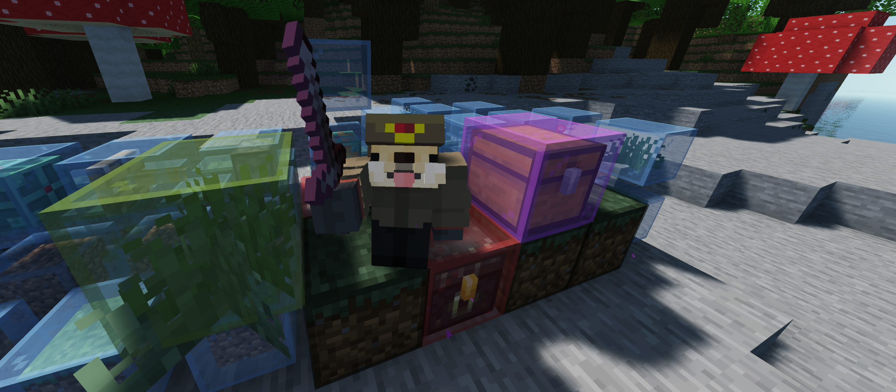

# SchematikZ

...a server-side building utility overlay minecraft plugin written in Kotllin. *No client mod needed* 🤯

> - with client and server performace in mind with some "hacks" I'm utilizing ghost blocks and display entities with packets to their full extent
> - similar in spirit to Litematica, but designed to run server-side
> - built for *survival building* (e.g. complex farms), *team projects*, and servers that want precise, reliable building guidance for everyone with as little friction as possible

## For players ⌨️
- Build with confidence: See exactly what goes where while building, without guessing orientations or missing details... Possibliy even as a team
- Survival-friendly workflows: Optional modes like “easy place” help you place correctly while still requiring the right materials
- Cleaner building sessions: The overlay is visual guidance - it doesn’t permanently modify the world just to “show” the schematic in any way
- Accurate block handling: Rotation, direction, hanging placements, and other tricky vanilla block behaviors are a priority

## For server owners 🖥️
- Performance-first rendering: Built around optimized, packet-based techniques to keep large schematics practical
- Highly Configurable behavior: Choose what fits your server style, scale and resources. By default it will work as if only the client had a mod :p
- Multiplayer-ready approach: Designed with visibility management and per-viewer handling in mind

# Status 🫀
This project is under active development, with a strong focus on stability, maintainability, and performance. If you want a server-side Litematica-style experience on Paper: SchematikZ is built for that.

Stay tuned ❤️
https://discord.gg/dVWHmAWrxn

## Schematicraft
I'm in direct contact with the dev of [schematicraft](https://schematicraft.com), feel free to visit it, its already really well working community focused schematic library. There will be strong integration with SchematikZ

> ## What’s planned
> SchematikZ is actively developed by me with a roadmap, including:
> - Massive-schematic optimizations (diff-based updates, distance-based batching, spatial partitioning, fail-safe on teleports/world changes)
> - Overlay QoL features: layer rendering, rotate/mirror overlays, per-player settings, completion visuals, basically everything litematica has, geometric shapes / text schematic generation
> - Ghost block / packet strategies to reduce client lag on huge builds
> - Support for all common schematic formats (e.g.: .litematic, .schem., .schematic, .nbt)
> - Extensibility: potential integration points (e.g., selection tools, schematic marketplaces)
> - Support for folia
> - Async processing to keep all more or less heavy work off the main thread
> - Persistence so overlays feel consistent across sessions
> - Eventually: richer automation modes and advanced visualization experiments with core shaders and custom model component resource packs, a proper version control system for builder teams
